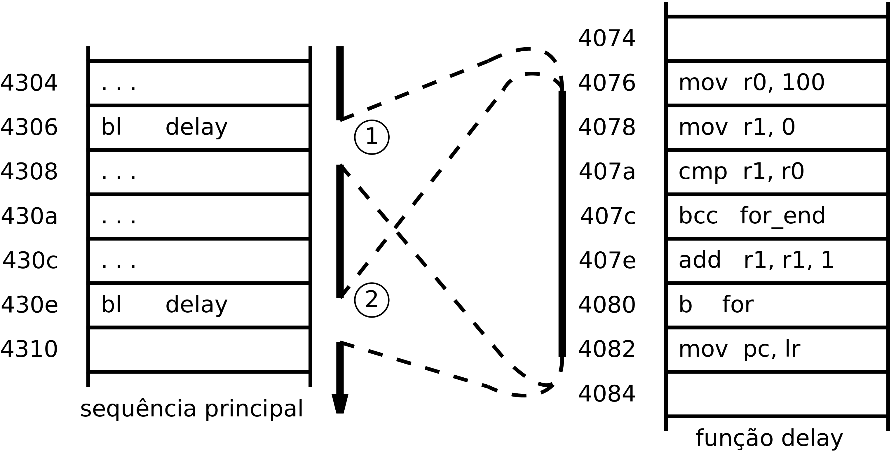
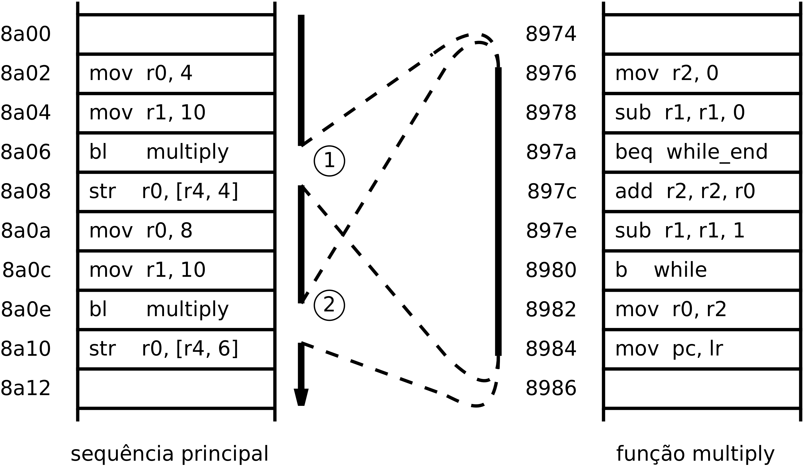

Funções
=======

“Função” é o termo que se usa na linguagem C para designar uma sequência de instruções
que realizam uma tarefa específica e pode ser invocada de diferentes contextos.
Também se usam na programação em geral termos como “rotina”, “subrotina”, “método”
(em linguagens OO) ou “procedimento” (SQL), com aproximadamente o mesmo significado.

O objectivo da sua utilização é subdividir e organizar os programas,
eventualmente extensos e complexos, em partes mais pequenas,
mais simples e reutilizáveis.

Neste texto usa-se o termo ”função”, por coerência com a utilização da linguagem C.

Uma característica importante num processador é o suporte à implementação de funções,
ou seja, a existência de um mecanismo que possibilite invocar um mesmo troço de programa
a partir de outro ponto do programa e retornar ao ponto de invocação.
Esta funcionalidade é concretizada pela acção que transfere a execução
para o endereço onde reside a função (de modo semelhante a uma instrução de salto)
e simultaneamente memoriza o endereço corrente.
A acção de retorno consiste em repor o endereço memorizado no PC.

No P16, durante a execução de uma instrução, o PC contém o endereço da instrução seguinte.
Se este valor for guardado como o endereço de retorno, fica assegurado o retorno à posição correta.
O endereço de retorno é guardado no registo R14, que devido a esta funcionalidade
tem também o nome de registo de ligação (*link register* ou LR).
A instrução BL, antes de afectar o PC com o endereço da função,
transfere o valor actual do PC para o LR.
O retorno ao ponto de invocação, faz-se copiando o conteúdo de LR para o PC.
Por exemplo, com a instrução ``mov  pc, lr``.

Função sem parâmetros
---------------------

Considere-se a sequência de duas chamadas à função ``void delay()``.

.. table:: Chamada a função sem parâmetros.
   :widths: auto
   :align: center
   :name: call_function_void

   +----------------------+-------------------------------+
   | .. code-block:: c    | .. code-block:: asm           |
   |                      |    :linenos:                  |
   |                      |                               |
   |    ...               |    ...                        |
   |    delay();          |    bl     delay               |
   |    ...               |    ...                        |
   |    delay();          |    bl     delay               |
   |    ...               |    ...                        |
   |                      |                               |
   | \(a\)                | \(b\)                         |
   +----------------------+-------------------------------+

A chamada a função sem parâmetros e sem valor de retorno
corresponde apenas à execução da instrução bl.
No programa da :numref:`call_function_void` (b), a instrução ``bl delay`` (linhas 2 e 4)
salta para o endereço indicado pela *label* *delay*.

.. table:: Programa de função sem parâmetros.
   :widths: auto
   :align: center
   :name: function_void

   +--------------------------------------+-------------------------------+
   | .. code-block:: c                    | .. code-block:: asm           |
   |                                      |    :linenos:                  |
   |    void delay(void) {                |                               |
   |        for (int i = 0; i < 100; ++i) |    delay:                     |
   |            ;                         |        mov    r0, #100        |
   |    }                                 |        mov    r1, #0          |
   |                                      |    for:                       |
   |                                      |        cmp    r1, r0          |
   |                                      |        bcc    for_end         |
   |                                      |        add    r1, r1, #1      |
   |                                      |        b      for             |
   |                                      |    for_end:                   |
   |                                      |        mov    pc, lr          |
   |                                      |                               |
   | \(a\)                                | \(b\)                         |
   +--------------------------------------+-------------------------------+

Na função **delay** a variável local **i** tem o âmbito do *for*.
Pode ser suportada num registo do processador.
No caso do programa da :numref:`function_void` (b), é suportada no registo R1.

   Ilustração de chamada a função sem parâmetros

Na primeira chamada, no endereço 0x4306, o processador começa
por transferir o conteúdo de PC (0x4308) para LR
e em seguida afecta o PC com o endereço de **delay** (0x4076).
Na segunda chamada, no endereço 0x430e, o processador realiza acções semelhantes,
com a diferença do valor de LR ser 0x4310.
Ao executar a instrução ``mov pc, lr`` posicionada no final da função,
no endereço 0x4082, o processamento regressa ao endereço 0x4308
na primeira chamada e regressa ao endereço 0x4310
na segunda chamada.

Função com parâmetros
---------------------

Considere-se a sequência de duas chamadas à função **multiply**
com a seguinte assinatura:

``uint16_t multiply(uint8_t multiplying, uint8_t multiplier);``

.. table:: Chamada de função com parâmetros
   :widths: auto
   :align: center
   :name: call_function_param

   +--------------------------------------+-------------------------------+
   | .. code-block:: c                    | .. code-block:: asm           |
   |                                      |    :linenos:                  |
   |    ...                               |                               |
   |    product[2] = multiply(4, 10);     |    mov    r0, #4              |
   |    product[3] = multiply(8, 10);     |    mov    r1, #10             |
   |    ...                               |    bl     multiply            |
   |                                      |    str    r0, [r4, #4]        |
   |                                      |    mov    r0, #8              |
   |                                      |    mov    r1, #12             |
   |                                      |    bl     multiply            |
   |                                      |    str    r0, [r4, #6]        |
   |                                      |                               |
   | \(a\)                                | \(b\)                         |
   +--------------------------------------+-------------------------------+

A função **multiply** tem dois parâmetros -- **multiplying** e **multiplier**
ambos do tipo **uint8_t** -- e retorna um valor do tipo **uint16_t**.
Na fase de chamada, antes da execução de *bl* é necessário passar os argumentos.
O que corresponde a colocar os valores dos argumentos no local que dá suporte aos parâmetros.
Nesta função utilizam-se o registo R0 para passar o primeiro argumento
e o registo R1 para passar o segundo argumento.

No programa (b) da :numref:`call_function_param`, na primeira chamada,
os argumentos 4 e 10, são carregados em R0 e R1 (linhas 1 e 2), respectivamente;
na segunda chamada os argumentos 8 e 12, são carregados em R0 e R1 (linhas 5 e 6), respectivamente.

.. table:: Programação de função com parâmetros
   :widths: auto
   :align: center
   :name: function_param

   +----------------------------------------------+-------------------------------+
   | .. code-block:: c                            | .. code-block:: asm           |
   |                                              |    :linenos:                  |
   |    uint16_t multiply(uint8_t multiplying,    |                               |
   |                      uint8_t multiplier) {   |    multiply:                  |
   |        uint16_t product = 0;                 |       mov   r2, #0            |
   |        while ( multiplier > 0 ) {            |    while:                     |
   |            product += multiplying;           |       sub   r1, r1, #0        |
   |            multiplier--;                     |       beq   while_end         |
   |        }                                     |       add   r2, r2, r0        |
   |        return product;                       |       sub   r1, r1, #1        |
   |    }                                         |       b     while             |
   |                                              |    while_end:                 |
   |                                              |       mov   r0, r2            |
   |                                              |       mov   pc, lr            |
   |                                              |                               |
   | \(a\)                                        | \(b\)                         |
   +----------------------------------------------+-------------------------------+

No programa (b) da :numref:`function_param` assume-se que
os registos de suporte aos parâmetros – R0 e R1 – já contêm os argumentos.
A variável local **product** como não prevalece para além do âmbito desta função
é suportada no registo R2, entre as linhas 2 e 10.
O valor de retorno da função -- o resultado da multiplicação -- é depositado no registo R0 (linha 10).

   Ilustração de chamada a função com parâmetros

Na :numref:`bl2` a instrução ``mov pc, lr``, no endereço 0x8984,
faz o processador retornar ao endereço 0x8a08 na primeira chamada
e ao endereço 0x8a10 na segunda chamada.
Nestas posições estão as instruções ``str r0,[r4,…]``
para guardar o valor retornado pela função **multiply**
que vem no registo R0.
