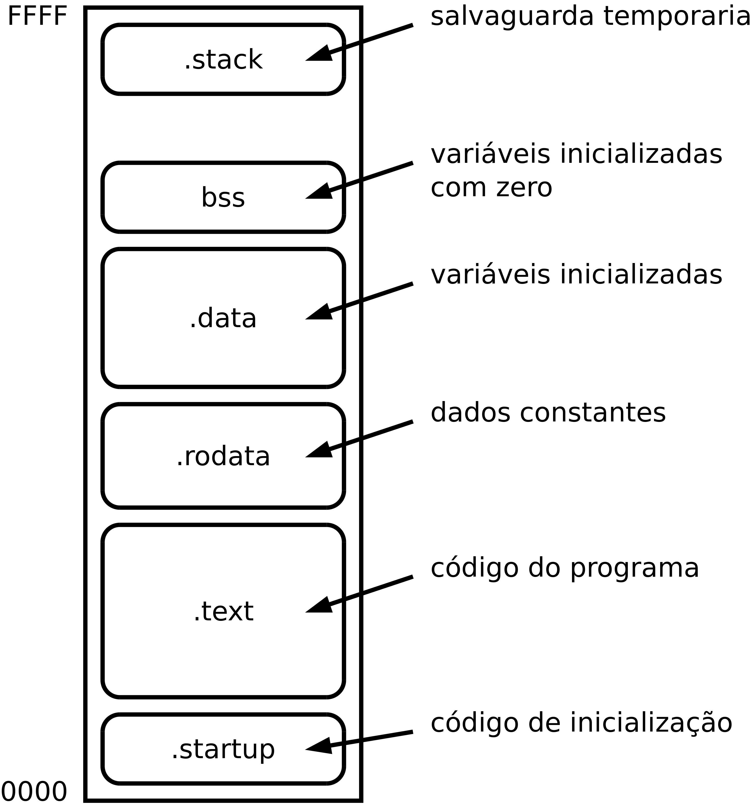

Estrutura dos programas
=======================

.. _estrutura de programa:

Para sustentar a adequada versatilidade na utilização do espaço de endereçamento,
um programa completo é organizado em secções.
As secções mais comuns são: secção para código de inicialização -- **.startup**;
secção para o *stack* -- **.stack**; secção para variáveis inicializadas -- **.data**;
secção para variáveis não inicializadas (segundo a norma da linguagem C são inicializadas com zero) -- **.bss**;
secção para constantes -- **.rodata**
e secção para o código do programa -- **.text**.

   Composição de um programa por secções

Em computadores de uso genérico, em que o espaço de endereçamento é preenchido,
no todo ou em parte, por memória contígua,
a ordem de localização das secções costuma ser:
código, constantes, variáveis inicializadas, variáveis inicializadas com zero
e por fim o *stack*.

Em computadores de uso específico (sistemas embebidos) o espaço de memória
comporta normalmente uma zona de memória não volátil, de apenas leitura,
onde são localizados o código e as constantes -- secções **.startup**, **.text** e **.rodata** --,
e uma zona de memória volátil, de leitura e escrita,
onde são localizadas as variáveis -- secções **.data**, **.bss** e **.stack**.

Secções
-------

As variáveis globais globais -- as que são definidas externamente às funções --,
como a variável **a** na linha 1
ou as variáveis locais estáticas, como a variável **b** na linha 4,
da :numref:`var_global_static_local`,
são alojadas nas secções .data, .bss ou .rodata, segundo certos atributos.

.. code-block:: c
   :linenos:
   :name: var_global_static_local
   :caption: Variável global e variável local estática

   int a;

   void function() {
           static int b;
           . . .
   }

.data
.....

Na secção **.data** são alojadas as variáveis com valores iniciais diferentes de zero.

+----------------------------------------------------+----------------------------------------------------------+
| .. code-block:: c                                  | .. code-block:: asm                                      |
|                                                    |                                                          |
|                                                    |           .data                                          |
|    uint8_t x = 23;                                 |   x:                                                     |
|                                                    |           .byte   23                                     |
|    static int i = 10000;                           |   i:                                                     |
|                                                    |           .word   10000                                  |
|    int integers[] = {100, 200, 300, 400};          |   integers:                                              |
|                                                    |           .word   100, 200, 30, 400                      |
|    char vowels[] = {'a', 'e', 'i', 'o', 'u';       |   vowels:                                                |
|                                                    |           .byte   'a', 'e', 'i', 'o', 'u                 |
|    char message[] = "Aqui, tudo bem!";             |   message:                                               |
|                                                    |           .asciz  "Aqui, tudo bem!"                      |
|    uint16_t bitmap[] = {                           |   bitmap:                                                |
|            0xA008, 0x0450, 0x7888, 0x4554, 0x9900  |           .word   0xA008, 0x0450, 0x7888, 0x4554, 0x9900 |
|    };                                              |                                                          |
|    uint32_t bigger = {0x7FFF3355};                 |   bigger:                                                |
|                                                    |           .word   0x3355, 0x7FFF                         |
+----------------------------------------------------+----------------------------------------------------------+

.bss
....

Na secção **.bss** são alojadas as variáveis com valores iniciais iguais a zero.

Na linguagem C as variáveis globais sem valor inicial explícito,
são inicializadas a zero.

+----------------------------------------------------+----------------------------------------------------------+
| .. code-block:: c                                  | .. code-block:: asm                                      |
|                                                    |                                                          |
|                                                    |           .bss                                           |
|    uint8_t x;                                      |   x:                                                     |
|                                                    |           .byte   0                                      |
|    int i = 0;                                      |   i:                                                     |
|                                                    |           .word   0                                      |
|    int integers[1000];                             |   integers:                                              |
|                                                    |           .space  1000 * 2, 0                            |
|    char vowels[20];                                |   vowels:                                                |
|                                                    |           .space  20, 0                                  |
|    uint16_t bitmap[10] = {0};                      |   bitmap:                                                |
|                                                    |           .space  10 * 2                                 |
|    static uint32_t bigger;                         |   bigger:                                                |
|                                                    |           .word   0, 0                                   |
+----------------------------------------------------+----------------------------------------------------------+

.rodata
.......

As constantes são alojadas na secção **.rodata**.

+-------------------------------------+---------------------------------------+
| .. code-block:: c                   | .. code-block:: asm                   |
|                                     |                                       |
|                                     |           .rodata                     |
|    const uint8_t x = 23;            |   x:                                  |
|                                     |           .byte   23                  |
|    const char newline = '\n';       |   newline:                            |
|                                     |           .byte   'n'                 |
|    static const int pi = 31415;     |   pi:                                 |
|                                     |           .word   31415               |
|    print("String literal\n");       |   L0:                                 |
|                                     |           .asciz  "String literal\n"  |
+-------------------------------------+---------------------------------------+

.text
.....

O código binário das instruções do programa assim com dados auxiliares ao código
são alojados na secção **.text**.

+---------------------------+------------------------------------+
| .. code-block:: c         | .. code-block:: asm                |
|                           |                                    |
|   int a = 3, b = 4, c;    |           .data                    |
|                           |   a:                               |
|   int main()              |           .word   3                |
|   {                       |   b:                               |
|           c = a + b;      |           .word   4                |
|   }                       |                                    |
|                           |           .bss                     |
|                           |   c:                               |
|                           |           .byte   0                |
|                           |                                    |
|                           |           .text                    |
|                           |   main:                            |
|                           |           ldr     r0, addressof_a  |
|                           |           ldr     r1, addressof_b  |
|                           |           ldr     r2, addressof_c  |
|                           |           ldr     r0, [r0]         |
|                           |           ldr     r1, [r1]         |
|                           |           add     r0, r0, r1       |
|                           |           str     r0, [r2]         |
|                           |           mov     pc, lr           |
|                           |                                    |
|                           |   addressof_a:                     |
|                           |           .word   a                |
|                           |   addressof_b:                     |
|                           |           .word   b                |
|                           |   addressof_c:                     |
|                           |           .word   c                |
+---------------------------+------------------------------------+

.stack
......

A secção **.stack** é uma zona de memória para salvaguarda de dados temporários,
necessários à execução do programa.

.. code-block:: asm
   :name: stack_section
   :caption: Reserva de memória para *stack*

           .stack
           .equ    STACK_MAX_SIZE, 1024
           .space  STACK_MAX_SIZE * 2
   stack_top:

Na :numref:`stack_section` exemplifica-se a reserva da memória para suporte à secção **.stack**.
O conteúdo inicial desta zona de memória é indiferente.

.startup
........

A secção **.startup** é uma secção de código. É separa da secção **.text**
para que estas secções possam ser localizadas separadamente.
A secção **.startup** tem obrigatoriamente que abranger o endereço 0x0000.

.. _codigo de arranque:

Código de arranque para o SDP16
-------------------------------

O SDP16 é um sistema de uso genérico para teste de programas.
A primeira metade do se espaço de endereçamento -- endereços de 0x0000 a 0x7fff --,
está preenchido com memória SRAM (volátil).
Os programas em teste são carregados nesta zona, a partir do endereço 0x0000.

Após a ação *reset*, o P16 passa a executar código a partir do endereço 0x0000.
Por isso, a secção **.startup** deve ser localizada no endereço 0x0000
(é o que acontece por omissão, se, como é usual,
for esta a primeira secção do ficheiro fonte).
As restantes secções podem ser localizadas em qualquer endereço do espaço de endereçamento.

O programa da :numref:`startup_code` apresenta-se como um exemplo de código de arranque
que prepara um ambiente de execução estruturado para o SDP16.
Este estabelece a existência e a posição das secções como descritas na :numref:`program`,
inicializa o registo SP com endereço de topo da secção **.stack**
e realiza uma chamada com ligação à função **main**.

.. code-block:: asm
   :linenos:
   :caption: Código de arranque
   :name: startup_code

   	.section .startup
   	b	_start
   	b	.

   _start:
   	ldr	sp, addressof_stack_top
   	mov	r0, pc
   	add	lr, r0, #4
   	ldr	pc, addressof_main
   	b	.

   addressof_stack_top:
   	.word	stack_top

   addressof_main:
   	.word	main

   	.text
   	.rodata
   	.data
   	.bss

   	.stack
   	.equ	STACK_MAX_SIZE, 1024
   	.space	STACK_MAX_SIZE * 2
   stack_top:

   ;------------------------------

   	.text
   main:
   	; ... código da função main
   	mov	pc, lr

Como o endereço 0x0002 é reservado ao atendimento de interrupções,
a primeira instrução a executar, localizada no endereço 0x0000,
é **b  _start** para que a execução prossiga noutro local.
Mesmo quando não se utilizam as interrupções,
o endereço 0x0002 deve ser preenchido pela instrução **b  .** (surge necessariamente na linha 3).
Se, por algum erro, o processador atender uma interrupção inesperada,
o processamento não se descontrola -- o processador ficará retido a executar indefinidamente esta instrução.

Para suporte à execução do programa,
entendido como uma cadeia hierárquica de chamadas a funções,
conforme ocorre na linguagem C, é necessário definir a área de memória dedicada ao *stack*
e a inicialização do registo *stack pointer* (SP) antes de se invocar a função **main**.

No exemplo, a área de memória para *stack* é definida com a diretiva **.space**
com a dimensão de 1024 *bytes*, confinada entre o início da secção *.stack*
e a *label* **stack_top** (linhas 24 a 26).
O registo SP é inicializado, na linha 6, com o valor da *label* **stack_top**
-- que corresponde ao endereço a seguir ao endereço mais alto da secção **.stack**
-- porque no P16 o empilhamento evolui no sentido descendente
com decremento prévio do apontador na instrução **push** (*full descending stack*).

A instrução **b  .** que vemos na linha 10,
mantém a execução controlada no caso da função **main** retornar.

As definições que aparecem nas linhas 1, 18, 19, 20, 21 e 23,
definem a existência das secções
**.startup**, **.text** e **.rodata**, **.data**, **.bss** e **.stack**,
assim como a sua localização relativa no espaço de endereçamento.

A definição do conteúdo das secções pode
ser escrita em qualquer lugar do restante programa.
Basta repetir a diretiva de secção.
(`ver aqui <https://p16-assembler.readthedocs.io/pt/latest/pas_assembly_language.html#seccoes>`_).

A localização das secções pode ser definida explicitamente
através de opções de invocação do p16as
(`ver aqui <https://p16-assembler.readthedocs.io/pt/latest/pas_utilizacao.html#localizacao-das-seccoes>`_).

Nas linhas 7 a 9 encontra-se uma sequência de instruções
que realiza um salto com ligação para a função ``main``,
equivalente a ``bl  main``.
Este código visa ultrapassar o limite de alcance da instrução BL.

O endereço do salto é calculado como um deslocamento, ascendente ou descendente,
em relação ao PC (endereçamento relativo).
O número limitado de *bits* no código binário da instrução BL,
para codificação deste deslocamento,
tem como efeito uma limitação no alcance do salto.

O deslocamento é codificado com 11 *bits* em código de complementos
-- um valor positivo provoca um avanço no PC e um valor negativo provoca um recuo.
Como os saltos são sempre para endereços pares,
o *bit* de menor peso não é registado no código da instrução, sendo utilizados apenas 10 bits.
Na prática o intervalo situa-se entre os endereços PC + 1022 e PC - 1024.
Um endereço fora deste intervalo não é alcançável pela instrução BL.

A sequência ::

   mov   r0, pc
   add   lr, r0, #4
   ldr   pc, addressof_main

supera a limitação de alcance, ao carregar diretamente no PC
o endereço da função ``main`` -- ``ldr   pc, addressof_main``.
As duas instruções anteriores servem para carregar em LR
o endereço de retorno.
A instrução ``mov   r0, pc`` coloca em R0 o valor atual de PC,
que é o endereço da instrução ADD,
e a instrução ``add  lr, r0, #4``, ao adicionar quatro a R0,
coloca em LR o endereço da instrução que se encontrar a seguir a LDR.

Inicialização da secção **.bss**
--------------------------------

A secção **.bss** destina-se a alojar variáveis sem valor inicial explícito
(`Wikipedia <https://en.wikipedia.org/wiki/.bss>`_).
A justificação para a exitência de uma secção separada da secção **.data**,
onde são alojadas as variáveis com valor inicial explícito,
é a não necessidade de ocupar espaço no ficheiro objeto
(do Inglês `object file <https://en.wikipedia.org/wiki/Object_file>`_).
No caso do P16, o ficheiro objeto é o ficheiro produzido pelo **p16as** com extensão **hex**.

A linguagem C define que variáveis estáticas sem valor inicial explícito
são alojadas na secção **.bss** e inicializadas a zero.
Faz parte da preparação do ambiente de execução compatível com a linguagem C,
a inicialização a zero da àrea de memória atribuida à secção **.bss**.

Na :numref:`cstart_code` apresenta-se um módulo de arranque para o PDS16
em o código das linhas 6 a 15 é responsável por esta operação.

Este código baseia-se nas *labels* ``bss_start`` e ``bss_end``.
Estas são pré-definidas nas linhas 37 e 39 como marcação de início
e de fim da secção **.bss**. Todo o conteúdo da secção **.bss** é inserida depois da *label* ``bss_start``
(`ver aqui <https://p16-assembler.readthedocs.io/pt/latest/pas_assembly_language.html#seccoes>`_).
A secção **.bss_end**, utilizada apenas para inserção da label ``bss_end``,
permanecerá por localização implicíta imediatamente após a secção **.bss**
(`ver aqui <https://p16-assembler.readthedocs.io/pt/latest/pas_utilizacao.html#localizacao-das-seccoes>`_).

A instrução ``str  r2, [r0]``, na linhs 11, escreve sucessivamente *words*
de valor zero nas posições de memória indicadas por R0.
Este vai iterar, de dois em dois endereços, desde o endereço de ``bss_start``
até ao endereço de ``bss_end``, presente em R1.
Estes endereços são pares porque correspondem a endereços de início de secção,
que por definição, são sempre pares.

.. code-block:: asm
   :linenos:
   :caption: Código de arranque com inicialização de **.bss**
   :name: cstart_code

   	.section .startup
   	b	_start
   	b	.

   _start:
   	ldr	r0, addressof_bss_start
   	ldr	r1, addressof_bss_end
   	mov	r2, #0
   	b	_start_bss_zero_cond
   _start_bss_zero:
   	str	r2, [r0]
   	add	r0, r0, #2
   _start_bss_zero_cond:
   	cmp	r0, r1
   	blo	_start_bss_zero

   	ldr	sp, addressof_stack_top

   	mov	r0, pc
   	add	lr, r0, #4
   	ldr	pc, addressof_main
   	b	.

   addressof_stack_top:
   	.word	stack_top
   addressof_main:
   	.word	main
   addressof_bss_start:
   	.word	bss_start
   addressof_bss_end:
   	.word	bss_end

	.text
	.rodata
	.data
	.bss
   bss_start:
	.section .bss_end
   bss_end:
	.section .stack
	.equ	STACK_SIZE, 1024
	.space	STACK_SIZE * 2
   stack_top:

   ;------------------------------

   	.text
   main:
   	; ... código da função main
   	mov	pc, lr

