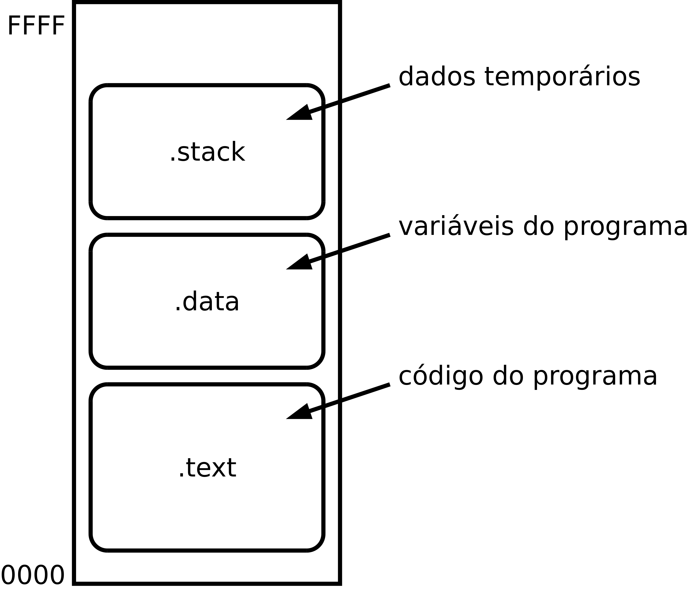

Estrutura dos programas
=======================

.. _estrutura de programa:

Para assegurar a adequada versatilidade na utilização do espaço de endereçamento,
de acordo com as caraterísticas dos dispositivos de memória que o populam
e as necessidades da aplicação,
um programa é organizado por zonas de memória.

Destacam-se três zonas:
   * zona para código binário das instruções;
   * zona para variáveis;
   * e zona para *stack*.

Estas zonas de memória são designadas na literatura inglesa por *segment* ou *section*.
Aqui, vais ser utilizado o termo "secção".

Para concretização deste modelo, definem-se três secções:
   * **.text** -- para o código binário das instruções e dados constantes;
   * **.data** -- para as variáveis que são modificadas durante a execução do programa;
   * **.stack** -- para suporte da execução estruturada com base em rotinas (funções).

   Organização do programa em três secções

.data
.....

As variáveis são alojadas na secção **.data**.

+----------------------------------------------------------+--------------------------------------------------------+
| .. literalinclude:: code/multiply_add_add/multiply.s     | .. literalinclude:: code/multiply_add_add/multiply.s   |
|    :language: c                                          |    :language: asm                                      |
|    :lines: 92-94                                         |    :lines: 90,97-104                                   |
+----------------------------------------------------------+--------------------------------------------------------+

.text
.....

O código binário das instruções do programa, assim com dados auxiliares ao código,
são alojados na secção **.text**.

+----------------------------------------------------------+--------------------------------------------------------+
| .. literalinclude:: code/multiply_add_add/multiply.s     | .. literalinclude:: code/multiply_add_add/multiply.s   |
|    :language: c                                          |    :language: asm                                      |
|    :lines: 23-26                                         |    :lines: 29,33-58                                    |
+----------------------------------------------------------+--------------------------------------------------------+

.stack
......

A secção **.stack** é uma zona de memória para salvaguarda de dados temporários,
necessários à execução do programa.
O conteúdo inicial desta zona de memória é indiferente.

A diretiva ``.space`` na linha 34 da :numref:`map_min`
reserva a área de memória cuja dimensão pode ser ajustada através do
símbolo ``STACK_MAX_SIZE`` definido na linha anterior.

Preparação
..........

O código do programa é organizado em funções. A primeira função a ser chamada
é a função **main** e todo o processamento útil é desencadeado a partir dela.

Após a ação reset, o P16 passa a executar código a partir do endereço 0x0000.
Neste endereço é localizado código que realiza
as necessárias preparações antes de invocar a função **main**
-- linha 11 da :numref:`map_min`.

A preparação consiste em inicializar o registo SP
com o endereço de topo da secção ``.stack`` --
linhas 10, 14 e 15 da :numref:`map_min`.

Localização
...........

A dimensão e a localização das secções no espaço de endereçamento
designa-se por mapa de memória.
As secções são localizadas pela ordem com que são escritas no ficheiro fonte do programa.
O endereço da secção seguinte é o endereço par imediatamente disponível
depois do fim da secção anterior.
A dimensão de cada secção depende do número de instruções
e do número de variáveis e respetivos tipos, definidos no seu interior.

.. literalinclude:: code/multiply_add_add/multiply.s
   :language: c
   :caption: Estrutura de código padrão para o modelo de organizaçãp mínimo
   :linenos:
   :name: map_min
   :lines: 1-16, 29-32, 87-93, 106-113

O código completo do programa utilizado como exemplo nesta secção pode ser descarregado daqui:
:download:`multiply.s<code/multiply_add_add/multiply.s>`.

O comando ::

   $ p16as multiply.s

gera os ficheiros multiply.hex e multiply.lst.

O mapa de memória do programa, que faz parte do ficheiro
:download:`multiply.lst<code/multiply_add_add/multiply.lst>`,
pode ser visualizado nas linhas 5 a 7 da
:numref:`multiply_lst`.

A secção **.text** começa no endereço 0x0000 por ser a que aparece em primeiro lugar
no ficheiro fonte do programa.

O endereço da secção **.data** é posterior à secção **.text** porque aparece em segundo lugar.
O seu endereço inicial é 0x0044 porque é essa a dimensão da secção anterior.

.. literalinclude:: code/multiply_add_add/multiply.lst
   :language: c
   :caption: Mapa de memória
   :linenos:
   :name: multiply_lst
   :lines: 1-8

As instruções ``b  program`` e ``b  .`` que aparem no início da secção **.text**
são localizadas nos endereços 0x0000 e 0x0002, respetivamente.
Estes endereços são fixados pela arquitetura P16, como os pontos de entrada em execução
dos acontecimentos *reset* e interrupção, respetivamente.
Razão pela qual o código de preparação não é localizado exatamente no endereço 0x0000.

A instrução ``b  .`` no endereço 0x0002 é apenas figurativa.
Este programa não está capacitado para realizar processamento de interrupções.

