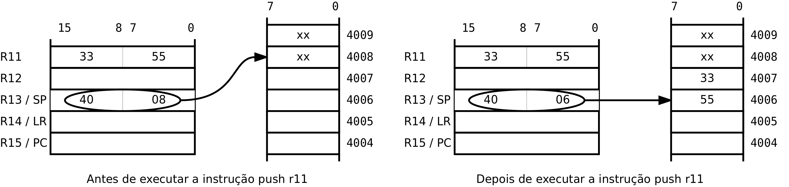
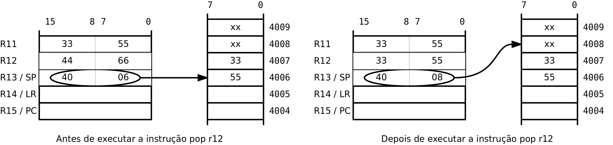

*Stack*
=======

O *stack* é uma zona de memória para salvaguarda temporária
de dados do programa de diversa natureza.
O seu nome advém do tipo de estrutura de dados que implementa ser do tipo *last-in-first-out* (LIFO),
também designada por *stack*.
Esta estrutura de dados tem um funcionamento análogo a uma pilha de objectos:
só se consegue retirar da pilha o objecto que se encontra no topo
-- o que foi lá colocado mais recentemente --
e só se consegue colocar um novo objecto sobre o topo da pilha
-- apenas sobre o objecto anteriormente lá colocado.

O P16 dispõe de um registo específico e duas instruções para manusear o *stack*.
O registo R13, neste contexto designado *stack pointer* (SP),
destina-se a guardar permanentemente o endereço corrente do topo do *stack*.
A instrução **push** coloca o conteúdo de um registo no topo do *stack*
e a instrução **pop** retira um valor do topo do *stack*,
colocando-o num registo.
As instruções **push** e **pop** transferem o conteúdo completo de um registo (uma *word*),
ou seja, não é possível transferir apenas um *byte* como acontece
com as instruções **ldrb** e **strb**.

A instrução **push** começa por decrementar o registo SP de duas unidades
e em seguida transfere o conteúdo do registo indicado para a posição do *stack*
definida por SP.

A instrução **push  rs** é equivalente à sequência ::

   sub  sp, sp, #2
   str  rs, [sp]

A instrução **pop** realiza a operação inversa do **push**.
Começa por incrementar o registo SP de duas unidades
e em seguida transfere o conteúdo da posição do *stack*,
definida por SP, para o registo indicado.

A instrução **pop  rd** é equivalente à sequência ::

   ldr  rd, [sp]
   add  sp, sp, #2

   Ilustração do funcionamento da instrução **push**

A :numref:`push` ilustra o efeito da execução da instrução **push r11**.
Antes da execução o SP contém o endereço 0x4008.
Ao executar a instrução **push** o processador começa
por decrementar o SP de duas unidades passando para 0x4006.
Em seguida escreve o *byte* menos significativo de R11 (0x55)
na posição de endereço 0x4006
e o byte mais significativo de R11 (0x33) na posição de endereço 0x4007.
O posicionamento dos *bytes* segue o critério *little-ended*.

   Ilustração do funcionamento da instrução **pop**

A :numref:`pop` ilustra o efeito da execução da instrução **pop r12**.
Antes da execução o SP contém o endereço 0x4006.
Ao executar a instrução **pop**, o processador começa por
transferir o conteúdo da posição de endereço 0x4006 (0x55)
para o *byte* menos significativo de R12
e o conteúdo da posição de endereço 0x4006 (0x33)
para o *byte* mais significativo de R12.
Em seguida incrementa o SP para o endereço 0x4008.
O conteúdo das posições de memória 0x4006 e 0x4007 não é alterado,
mas estas posições ficam disponíveis para serem reutilizadas
na próxima instrução **push**.
