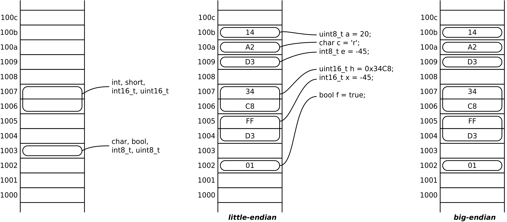
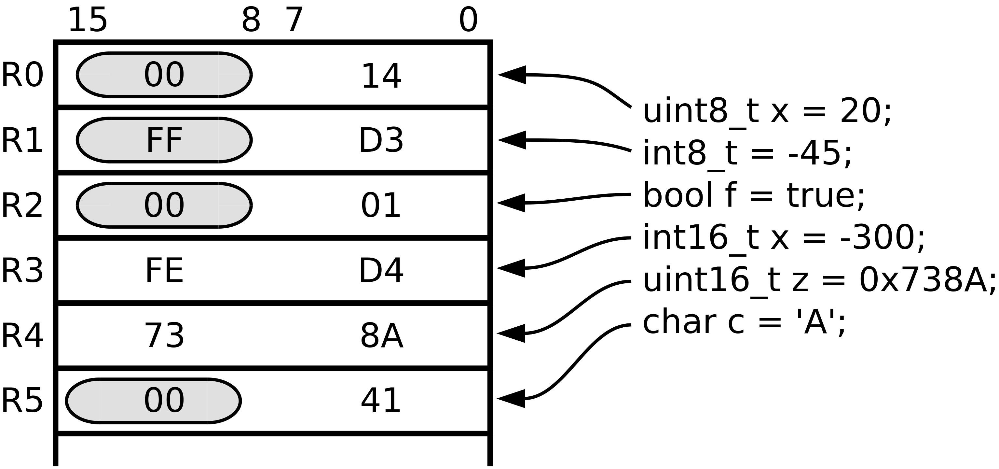

Tipos de dados
==============

Na programação em *assembly* do P16,
tendo como referência a linguagem C,
considera-se que os tipos básicos são representados com as dimensões em *bits*
indicadas na :numref:`tipos-dimensoes`.

.. table:: Dimensões dos tipos básicos da linguagem C na arquitetura P16
   :align: center
   :name: tipos-dimensoes

   +----------+--------------------+
   | Tipo     | Dimensão (*bits*)  |
   +==========+====================+
   | char     | 8                  |
   +----------+--------------------+
   | short    | 16                 |
   +----------+--------------------+
   | int      | 16                 |
   +----------+--------------------+
   | long     | 32                 |
   +----------+--------------------+

O tipo ``char`` considera-se equivalente a ``unsigned char``.

Dados em memória
----------------

Os valores de tipos representados com palavras de 8 *bits*
podem ser alojados em qualquer posição da memória.

Os valores de tipos representados com palavras de dois *bytes*,
ocupam duas posições de memória contíguas.

A posição de memória de endereço mais baixo deve ser par -- designa-se alinhamento par.
Na referenciação por endereço de uma palavra de múltiplos *bytes*, utiliza-se
o endereço menor.

Por exemplo, na :numref:`memory_types` a palavra que suporta a representação da variável **h**,
ocupa duas posições de memória, possui alinhamento par e o seu endereço é **0x0006**.

   Valores de tipos básicos em memória

Dados em registo
----------------

As instruções do P16 operam sobre valores a 16 *bits*.
Ao carregar um valor a 8 *bits* (tipos ``char``, ``int8_t`` ou ``uint8_t``)
num registo do processador, é necessário extender a representação desse valor
para 16 *bits*.
Para o tipo ``char`` e ``uint8_t`` a extensão consiste em afetar
os *bits* das posições 8 a 15 com o valor zero.
Para o tipo ``int8_t`` a extensão consiste em afetar os *bits* das posições 8 a 15
com o valor do bit da posição 7 (*bit* de sinal).

Na :numref:`types_in_registers_a` exemplifica-se o carregamento de valores de
diversos tipos em registos do processador.
Os conteúdos dos registos estão escritos em hexadecimal.
As zonas sombreadas correspondem a conteúdos acrescentados para extensão da representação.
Por exemplo, o registo R1 recebe nas posições 0 a 7 o valor 0xD3,
e nas posições 8 a 15 o valor 0xff para manter a representação do valor -45.

   Valores de tipos básicos em registos
